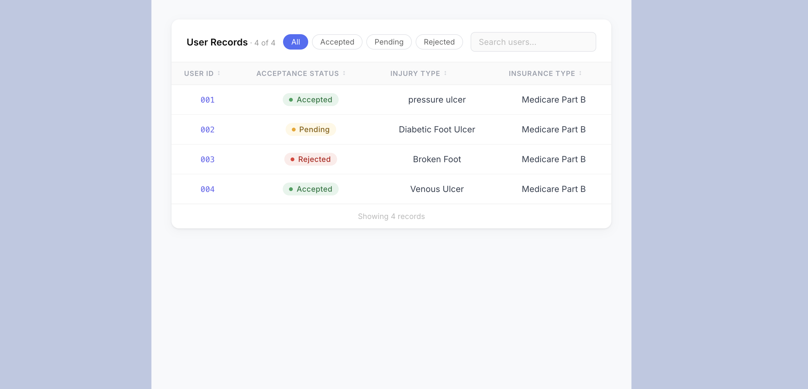

# Single-Patient Wound Eligibility Engine

This deliverable covers the component whose scope starts after PCC data has already been retrieved. It does not call the mock API, retry failed requests, parallelize fetches, manage rate limits, or render the dashboard.

## Vercel Hosting Link
https://hackathon-abi-frameworks.vercel.app/ 

## Component Scope




## Available Scripts
Input: one patient's already-fetched data from four source families:

- Demographics / patient identity
- Diagnoses
- Insurance coverage
- Progress notes
- Structured wound assessments

Output: one normalized row per patient with wound evidence, Medicare Part B status, a routing decision, a standardized `Accept` / `Reject` billing decision, and a concise biller-facing reason.

## Function Contract

The API/integration layer should call this function once per patient:

```python
from wound_eligibility import evaluate_patient

result = evaluate_patient({
    "patient": patient,
    "diagnoses": diagnoses,
    "coverage": coverage,
    "notes": notes,
    "assessments": assessments,
})
```

Input sources:

- `patient`: one object from `/pcc/patients`
- `diagnoses`: records from `/pcc/diagnoses`, fetched with `patient.patient_id`
- `coverage`: records from `/pcc/coverage`, fetched with `patient.patient_id`
- `notes`: records from `/pcc/notes`, fetched with `patient.id`
- `assessments`: records from `/pcc/assessments`, fetched with `patient.id`

## Eligibility Rules

A patient is accepted only when all of the following are documented:

- Active Medicare Part B coverage
- Active wound evidence from an assessment, progress note, or diagnosis
- Wound type
- Measurements: length, width, and depth in centimeters
- Drainage amount normalized to `none`, `light`, `moderate`, or `heavy`

If any required item is absent or coverage is not active Medicare Part B, the patient is rejected with the missing evidence named in the reason.

## Hackathon Alignment

This component covers the single-patient logic inside the broader hackathon pipeline:

- API fetching, retry handling, rate limiting, parallelization, storage, and dashboard rendering are handled outside this module.
- This module receives one already-hydrated patient payload and returns one normalized row for the downstream output table.
- The broader challenge names routing decisions as `auto_accept`, `flag_for_review`, and `reject`. This component emits both `routing_decision` for the hackathon workflow and `decision` as the binary billing handoff.

| Condition | `routing_decision` | `decision` |
|---|---|
| Active Medicare Part B, wound evidence, measurements, and drainage are all present | `auto_accept` | `Accept` |
| Active Medicare Part B and wound evidence are present, but one or more required wound fields are missing | `flag_for_review` | `Reject` |
| No active Medicare Part B or no wound evidence | `reject` | `Reject` |

## Run

```bash
PYTHONPATH=src python -m wound_eligibility.cli examples/accept_patient.json --pretty
```

## Test

```bash
PYTHONPATH=src python -m pytest
```

## Output Shape

```json
{
  "patient_id": "FA-001",
  "internal_id": 1,
  "patient_name": "Agnes Dunbar",
  "facility_id": 101,
  "active_medicare_part_b": true,
  "coverage_source": "Medicare Part B / MCB / Medicare B; effective_from=2020-01-01T00:00:00",
  "active_wound_found": true,
  "wound_type": "pressure_ulcer",
  "stage": "2",
  "location": "Sacrum",
  "length_cm": 3.2,
  "width_cm": 2.1,
  "depth_cm": 0.4,
  "drainage_amount": "moderate",
  "evidence_source": "assessment",
  "evidence_text": "Structured wound assessment",
  "missing_fields": [],
  "decision": "Accept",
  "reason": "Active wound, measurements, drainage, and Medicare Part B coverage are documented.",
  "routing_decision": "auto_accept"
}
```

## Design Notes

- Structured assessments are preferred over notes because they carry labeled measurement fields.
- Notes are parsed deterministically for labeled SOAP fields, prose measurements such as `4.2x3.1x1.5cm`, wound keywords, location, stage, and drainage terms.
- Diagnosis-only evidence can identify a wound, but it is not enough to accept because Medicare Part B billing requires measurements and drainage.
- The engine keeps source and evidence text in the output so a biller or downstream dashboard can explain why a patient was accepted or rejected.
